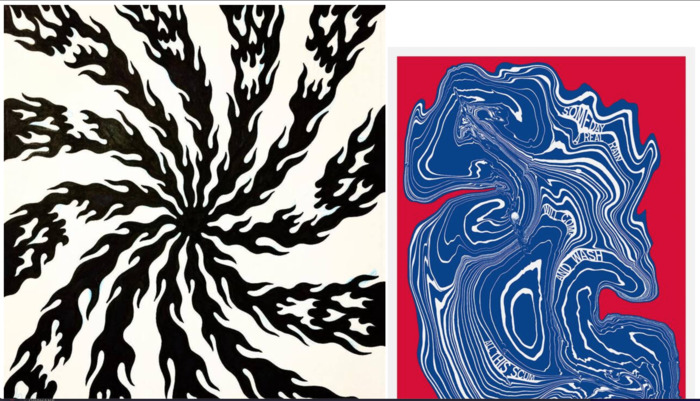

# Hack This Zine!
## A T550 Final Project

I want to make a zine that is an HTML file and talks about HTML and CSS basics. The zine will introduce readers to the languages by showing them how to use the Web Inspector to inspect the structure of the zine itself! I hope that people will be inspired to personalize their copy of the zine and share it with others.

For now, this README will be my documentation of the process of making.

### **October 10th, 2021 (Sunday)**
After initial setup (creating the HTML file, this README file, and a GitHub repo), I decided to start not with the beginning of the zine but with something I've never tried before: embedding an image into an HTML file itself. My thinking is that the zine would be a little boring without images, but I also want to keep the zine encapsulated within a single file. I also have this vague idea that it might be nice to show classic zines as design inspiration when I prompt readers to personalize their zine.

I followed [these](https://www.thesitewizard.com/html-tutorial/embed-images-with-data-urls.shtml) instructions on converting an image to base64. That worked pretty well! The only kind of annoying thing is that the base64 encoding is a VERY LONG text line that's unwieldy in my code editor. I was afraid that it meant that it would be a very long line in the Web Inspector but at least Chrome was smart enough to obfuscate that.

I decided to try just linking to an image hosted somewhere else too. That worked just as fine! My only issue would be if the links break in the future depending on where I host the image. Although embedding base64 images has its downsides too, the ones I mentioned before and also the fact that it bloats the file size. I'll sit on deciding what to do for now.

Here's where I'm at, just some sample images:

Next big task: how can I save changes made through the Web Inspector to the original file?

### **October 21st, 2021 (Thursday)**

I'm back with some dedicated Final Project work time! I originally wanted to embed images into the HTML file because I didn't want to rely on having an internet connection. BUT... I think showing newcomers how to link to an image is much easier than showing how to use the terminal to do base64 encoding. So I'm going back to linked images for now.

I got some work done on basic CSS styling following [Brutalist Web Design principles](https://brutalist-web.design/) (thanks to Paulina for sharing that link!) and [Web Design in 4 Minutes](https://jgthms.com/web-design-in-4-minutes/). I also skipped writing the Intro (it's so important so feels hard to start with) and started writing the very beginning of opening the Web Inspector! Which is also important and I'm having a little bit of "nothing sounds good enough" thoughts but pushing through. Managed to write a couple of paragraphs. I'm particularly happy with an idea I had to ask questions and have a &lt;textarea /> for the reader's response! It's not going anywhere but... neither do 95% of my notes I write when asked to write down a response to something in a class/meeting.